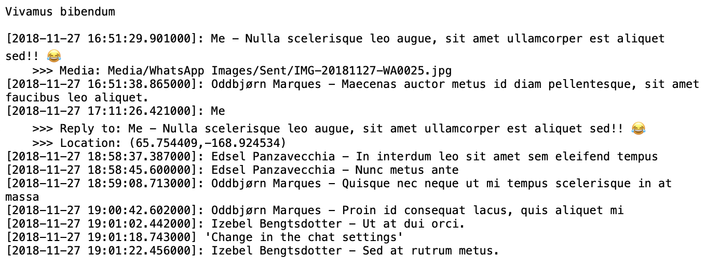
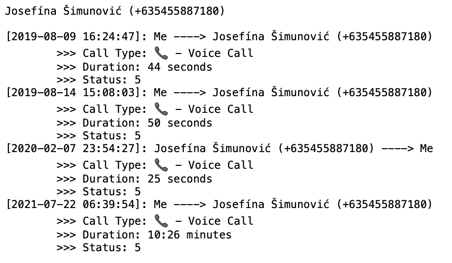
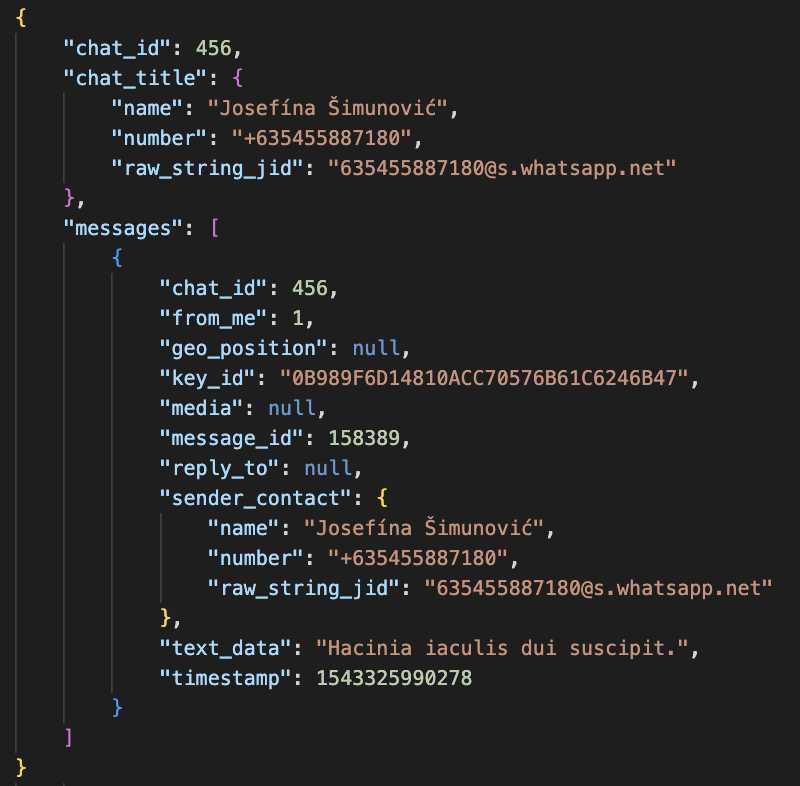
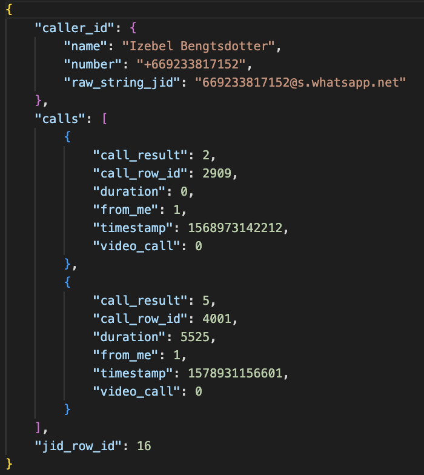

# Whatsapp Backup Chat Viewer


[](https://github.com/Dexter2389/whatsapp-backup-chat-viewer/actions/workflows/tests-ci.yml)
[](https://codecov.io/gh/Dexter2389/whatsapp-backup-chat-viewer)


Extract Whatsapp conversations from the app's SQLite database and exporting them as JSON or TXT files.

#### TXT Export Output

|                   Chat Text Output                    |                   Call Text Output                    |
| :---------------------------------------------------: | :---------------------------------------------------: |
|  |  |

#### JSON Export Output

|                    Chat JSON Output                    |                    Call JSON Output                    |
| :----------------------------------------------------: | :----------------------------------------------------: |
|  |  |

### Motivation

Recently I lost my phone and as any normal person, my whatsapp contained lots of data that I wasn't willing to let go and I had to find a way to get this data back. So I somehow (tbh not somehow, there are a lot of people who have shared how to fetch that) was able to get the whatsapp's SQLite database from my google backup. But having just the database doesn't help me much so I decided to create a parser for the database and export in chat format as JSON.

### Features

- Export the chats to txt files.
- Export the chats to JSON files.

## Usage

### Prerequisites:

- WhatsApp Versions supported currently:
  - 2.21.24.22
- [Whatsapp Database file](#retrieving-whatsapp-databases)
  - msgstore.db
  - wa.db

### Quickstart:

- Ensure `Python` (version 3.8 or higher) is installed.
- Run the main script:

```shell
$ python main.py -mdb msgstore.db -wdb wa.db -o output
```

## Retrieving WhatsApp Databases

### From Android

If you have an Android phone, your WhatsApp database is stored in a location of the filesystem with restricted access, which makes it bit difficult to extract your databases. Following are the few steps that can help you extract your databases from your Android Phone.

1. Install [`adb`](https://www.xda-developers.com/install-adb-windows-macos-linux/) on your machine.
2. Now, connect your mobile phone with a USB cable and put your phone in MTP mode.
3. Based on your preferences, you can choose any one of the following:

   1. With [rooted phone](https://en.wikipedia.org/wiki/Rooting_%28Android%29)
      In case you have your phone rooted, you can use the following commands to copy all your WhatsApp files to the local directory.

      ```
      $ mkdir whatsapp_backup
      $ adb pull /data/data/com.whatsapp/ whatsapp_backup/
      ```

   2. Without rooted phone
      If you don't wish to root your phone, you can follow these steps to copy all your WhatsApp files to the local directory:

      - Backup all your whatsapp chats by clicking `Backup Now` in settings.
      - Download enhanced whatsapp app.

        ```
        $ mkdir tmp
        $ curl -L -o tmp/EnhancedWhatsApp.apk https://github.com/Dexter2389/whatsapp-backup-chat-viewer/raw/main/assets/EnhancedWhatsApp.apk
        ```

        <!-- $ curl -L -o tmp/EnhancedWhatsApp.apk http://dl.imobie.com/android/specified-app.apk -->

      - Uninstall existing whatsapp app and install the enhanced app.
        ```
        $ adb shell pm uninstall -k com.whatsapp
        $ adb install -r -d tmp/EnhancedWhatsApp.apk
        ```
      - Open the enhanced app and restore your whatsapp account. Remember to restore your chats from your previously created backups (either from Google Drive or from local backup).
      - After the restore process has finished, run the following command:
        ```
        $ mkdir -p whatsapp_backup/databases whatsapp_backup/files
        $ adb shell 'run-as com.fwhatsapp tar cf - /data/data/com.fwhatsapp/' | tar xvf -
        $ cp data/data/com.fwhatsapp/databases/msgstore.db data/data/com.fwhatsapp/databases/wa.db whatsapp_backup/databases/
        $ cp data/data/com.fwhatsapp/files/key whatsapp_backup/files/
        ```
      - Once we have copied all the files, delete the enhanced whatsapp app.
      - (Optional) Reinstall the regular whatsapp app again from the App Store.

4. The required files are located in the following paths:

   - whatsapp_backup/files/key
   - whatsapp_backup/databases/msgstore.db
   - whatsapp_backup/databases/wa.db

<!-- ### From an iPhone

(This section will be updated soon.) -->

## Development

Before you begin, ensure you have met the following requirements:

- `Python` (version 3.8 or higher) installed.
- [`Poetry`](https://python-poetry.org/docs/master/#installing-with-the-official-installer) is installed.

1. Now that you have met the requirements, clone this repository locally:

   ```shell
   $ git clone https://github.com/Dexter2389/whatsapp-backup-chat-viewer.git
   $ cd whatsapp-backup-chat-viewer
   ```

2. Once you have a copy of the source, install the project dependencies:
   ```shell
   $ poetry install
   ```
3. Enable `pre-commit`.
   ```shell
   $ pre-commit install
   ```
4. (Optional) Feel free to give the repository's testing suite a shot:
   ```shell
   $ pytest --cov-report=term-missing --cov=src --cov-report=xml --junitxml=report.xml --basetemp=tests/unit/tmp tests/
   ```

You are now all set to contribute to this project.

<!-- ## Future Scope

- Add User Interface
- Add Chat Analytics [Examples: (https://github.com/MaartenGr/soan), (https://github.com/joweich/chat-miner), (https://github.com/irfanchahyadi/Whatsapp-Chat-Analyzer)] -->

## License

This project is licensed under the [BSD-2-Clause License](./LICENSE.md)

## Disclaimer

This project is not endorsed or certified by WhatsApp Inc. and is meant for personal and educational purposes only. I don't take any not responsible, and expressly disclaims all liability for damages of any kind arising from the use, reference or reliance on the software. The information provided by the software is not guaranteed to be correct, complete and up-to-date.
